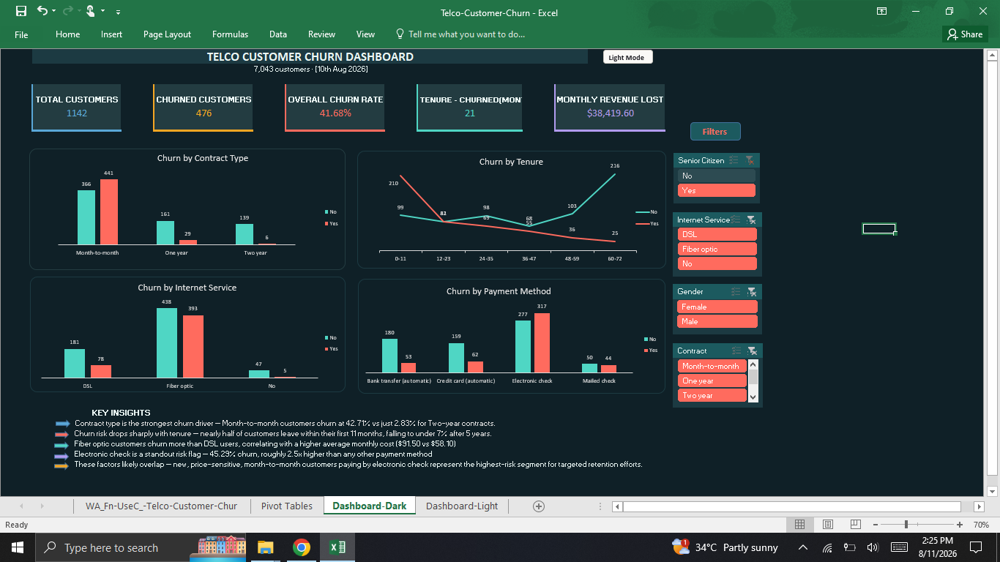
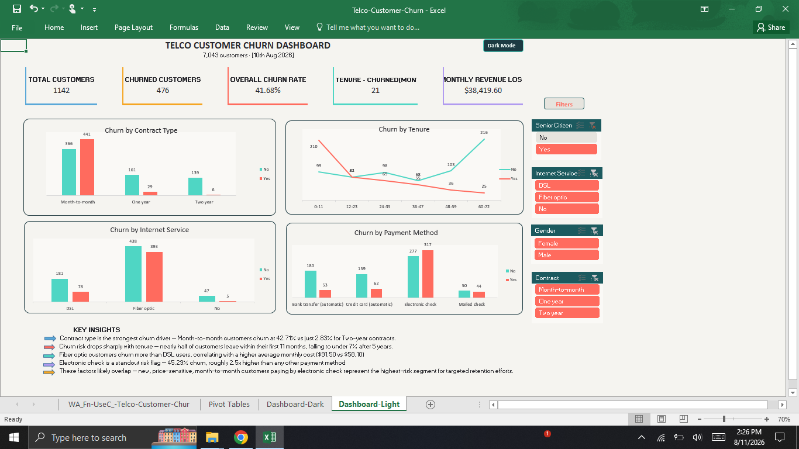

# Telco Customer Churn Analysis

An end-to-end data analytics project exploring what drives customer churn at a telecom company — from raw data to an interactive dashboard, with Power BI, SQL, and Python phases in progress.

## 📊 Dataset

- **Source**: [Telco Customer Churn (Kaggle / IBM Sample Dataset)](https://www.kaggle.com/datasets/blastchar/telco-customer-churn)
- **Size**: 7,043 customers, 21 features
- **Target variable**: `Churn` (Yes/No) — whether the customer left within the last month

Features cover customer demographics, account information (tenure, contract type, payment method), and subscribed services (internet, phone, streaming, security add-ons).

## 🧹 Data Cleaning

- Identified and resolved 11 blank `TotalCharges` values — all belonged to customers with `tenure = 0` (brand-new signups not yet billed), so these were set to `0` rather than dropped, preserving valid records
- Standardized `SeniorCitizen` from `0`/`1` to `No`/`Yes` for consistency with other categorical columns
- Verified data integrity: zero duplicate rows, all categorical fields consistent (no typos/casing issues)
- Converted the cleaned dataset into a structured Excel Table to support dynamic formulas and PivotTables

## 📈 Excel Dashboard

Built a fully interactive dashboard (with matching Dark and Light theme versions) featuring:

- **5 live KPI cards**: Total Customers, Churned Customers, Overall Churn Rate, Avg Tenure of Churned Customers, Monthly Revenue Lost — all driven by dynamic formulas (`COUNTIFS`, `SUMIFS`, `AVERAGEIFS`, `GETPIVOTDATA`) that update with filters
- **4 PivotCharts**: Churn by Contract Type, Churn by Tenure, Churn by Internet Service, Churn by Payment Method
- **Cross-filtering slicers** (Contract, Internet Service, Senior Citizen, Gender) connected across all charts and KPIs simultaneously
- **Dark/Light theme toggle** via linked navigation buttons
- A written **Key Insights** panel synthesizing the findings

## 🔑 Key Insights

1. **Contract type is the strongest churn driver** — Month-to-month customers churn at **42.71%** vs just **2.83%** for Two-year contracts (a 15x difference)
2. **Churn risk drops sharply with tenure** — nearly half of customers (48.28%) leave within their first 11 months, falling to under 7% after 5 years
3. **Fiber optic customers churn more than DSL users** (41.89% vs 18.96%), correlating with a higher average monthly cost ($91.50 vs $58.10) — suggesting price sensitivity plays a role
4. **Electronic check is a standout risk flag** — 45.29% churn, roughly 2.5x higher than any other payment method (Bank transfer, Credit card, Mailed check all sit in the 15–19% range)

**Takeaway**: these factors likely overlap. New, price-sensitive, month-to-month customers paying by electronic check represent the highest-risk segment for targeted retention efforts.

## 🖼️ Dashboard Preview

## 🔜 Next Steps

- [ ] Power BI dashboard (native DAX measures, cross-filtering visuals)
- [ ] SQL analysis (querying, aggregations, window functions)
- [ ] Python analysis (pandas, statistical deep-dive, visualization)

## 🛠️ Tools Used

`Excel` · `PivotTables` · `PivotCharts` · `Slicers` · Formulas: `IFERROR`, `COUNTIFS`, `SUMIFS`, `AVERAGEIFS`, `GETPIVOTDATA`

---

📫 Connect with me on [LinkedIn](#) — feedback and suggestions welcome!
